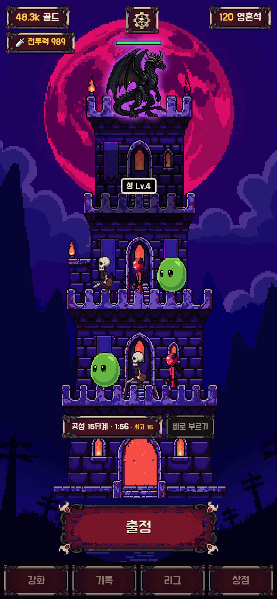
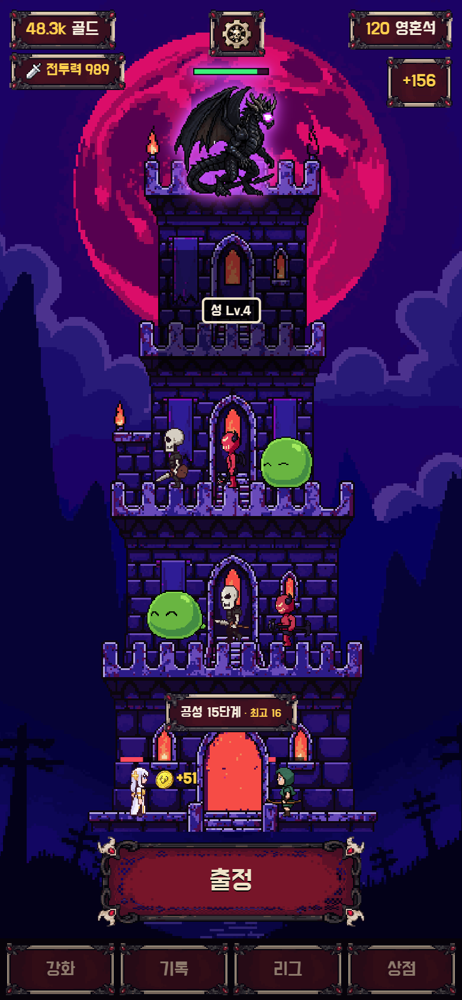
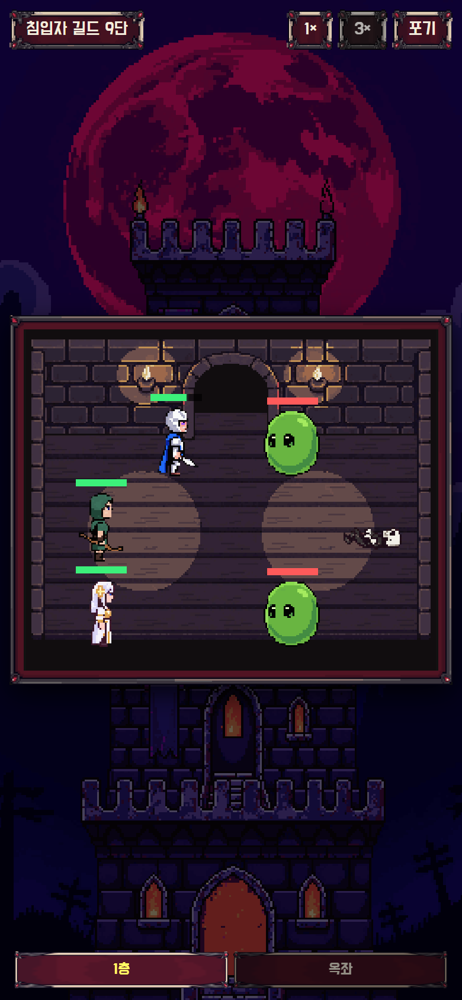
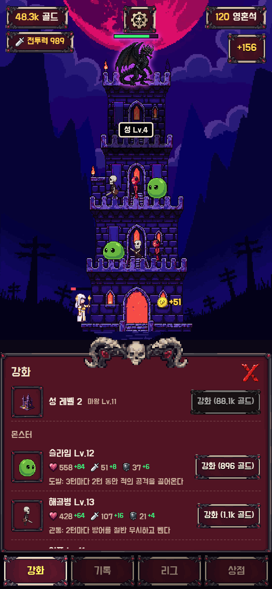
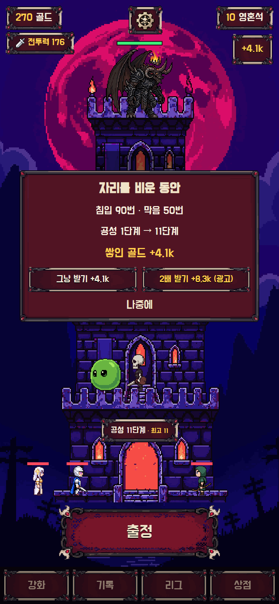
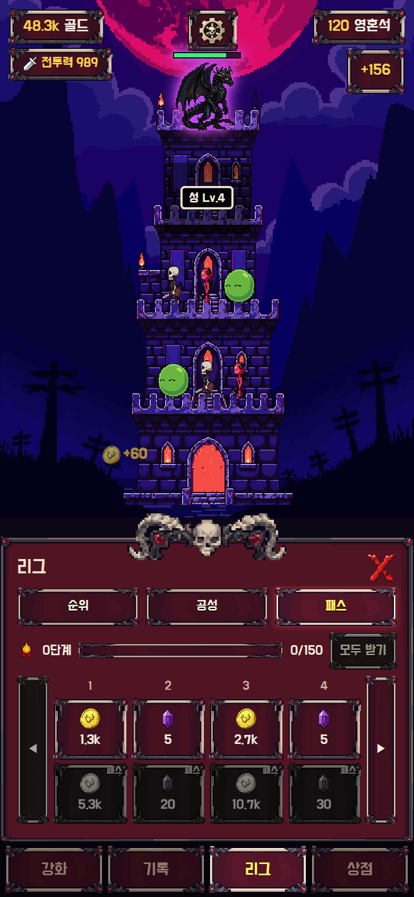

# 낮엔 용사, 밤엔 마왕

> 낮에는 남의 성을 털고, 밤에는 내 성을 지킨다.

용사 셋을 이끌고 다른 마왕의 탑을 공략하고, 내 탑에는 몬스터를 세워 밤마다 몰려오는 침입자를 막는
방치형 성 키우기 게임입니다. Verse8(Agent8) 플랫폼에 배포했고, 설치 없이 브라우저에서 바로 돌아갑니다.
세로 화면에 맞췄고, 마우스 클릭(터치)만으로 조작합니다.

**▶ 플레이: https://verse8.io/Y4e8r8Z**

<p>
  
  
  
</p>

## 어떤 게임인가

화면에는 늘 내 마왕성 탑이 서 있습니다. 탑의 층마다 몬스터를 세우고, 꼭대기에는 마왕이 앉아 있습니다.

- **밤 — 공성(방어):** 2분마다 침입 용사 셋이 탑으로 몰려옵니다. 층의 몬스터와 마왕이 막으면 공성 단계가
  오르고 골드가 쌓입니다. 뚫리면 단계가 하나 내려갑니다. 자리를 비운 동안의 파도도 최대 8시간치를 돌아왔을 때
  한 번에 계산합니다. 다음 파도 20초 전부터(직전 파도가 뚫렸으면 언제든) "바로 부르기"로 당겨 올 수 있고,
  공성 재생은 1×/2× 무료, 3×는 상점 상품입니다.
- **낮 — 출정(공격):** 내 용사 셋(기사·궁수·성직자)으로 다른 성을 공략합니다. 층을 하나씩 뚫고 옥좌의 마왕까지
  쓰러뜨리면 전리품과 명예를 얻습니다. 상대는 모두에게 같은 난이도의 "침입자 길드 N단"과 실제 플레이어의 성입니다.
- **성장:** 골드로 몬스터·용사·성을 강화합니다. 능력치는 레벨마다 ×1.15로 복리 성장하고, 숫자는 k·m·b 단위로
  커집니다. 시작 전투력 100에서 두 달쯤이면 백만(m) 단위까지 올라갑니다.

<p>
  
  
  
</p>

## 주요 기능

**공성과 출정**
- 공성 단계는 모두에게 같은 난이도라 "몇 단계까지 버티나"가 그대로 순위가 됩니다(계정당 최고 기록, 서버 기록).
  처음 넘은 10단계마다 영혼석 보상.
- 전투는 층 단위 라운드 전투입니다. 몬스터·용사마다 스킬(도발, 관통, 연사, 치유, 광역 화염, 되살리기 등)이 있고,
  기가 차면 궁극기가 자동으로 나갑니다. 1×/2× 무료, 3×는 상점 상품.
- 용사 레벨은 출정 전리품(+1%/레벨)과 공성 방어(+1%/레벨)를 함께 올립니다.

**방치형 흐름**
- 돌아오면 "자리를 비운 동안" 카드로 침입 횟수·막은 횟수·단계 변화·쌓인 골드를 보여 주고, 그냥 받기 / 광고 보고
  1.5배 받기를 고릅니다.
- 쓰러진 침입자 자리에서 금화와 받은 골드(+숫자)가 튀어 오릅니다.

**운영 요소**
- 2주 시즌 리그(30명 브래킷), 명예로 오르는 10단계 시즌 패스 보상 트랙(무료 줄·패스 줄).
- VX Shop 상품 5종(스타터 팩, 새끼 용, 시즌 패스, 3배속, 프리미엄 패스)과 Verse8 보상형 광고 4종.
- 유료 마왕 외형 2종(해골 군주, 흑룡) — 홈과 전투에서 보랏빛 테두리가 빛납니다.
- 스토리 컷신 → 닉네임 → 아무 데나 눌러도 진행되는 클릭 튜토리얼. 설정(음량, 닉네임 변경, 진행 초기화).

## 기술 스택

| 영역 | 사용 기술 |
|---|---|
| 클라이언트 | React 18, TypeScript 5.7, Vite 8 |
| 렌더링 | DOM + CSS 스프라이트 시트(홈·공성), Canvas 2D(전투) |
| 서버 | Verse8 Agent8 Game Server (`server/src/*.ts`, 원격 함수 · `$global` 상태/컬렉션 · `$asset` 재화 · `$lock`) |
| 플랫폼 | `@agent8/gameserver`, `@verse8/platform`(VX Shop), `@verse8/ads`(보상형 광고) |
| 테스트 | Vitest 143개(순수 게임 규칙·밸런스), Agent8 서버 하네스 25개(원격 함수) |
| 아트 | PixelLab으로 생성한 픽셀 아트(유닛·배경·UI 키트·아이콘·컷신) |

## 구조에서 신경 쓴 것

**조작되면 안 되는 값은 전부 서버에서**
골드·영혼석은 Verse8 Asset, 진행도는 Global User State, 순위는 Global Collection에 둡니다. 원격 함수는
누구나 부를 수 있는 공개 엔드포인트라고 보고, 클라이언트가 보낸 점수·보상·결과는 쓰지 않습니다. 공성 결과,
전리품, 광고·패스 보상, 결제 지급(`$onItemPurchased`, 같은 구매 ID 중복 지급 방지)은 서버가 직접 계산합니다.

**결정론 전투 — 서버와 화면이 같은 결과**
전투는 `server/src/battle.ts`의 순수 함수이고 시드(`계정 + 시각`)로만 무작위가 정해집니다. 서버가 공성 파도의
승패를 정하면, 화면은 같은 결과를 걸어오고 싸우고 쓰러지는 연출로 재생합니다. 게임 규칙은 DOM을 모르기 때문에
Vitest에서 그대로 돌립니다.

**시뮬레이션으로 맞춘 성장 곡선**
성장 공식은 `server/src/growth.ts`, 숫자는 `BALANCE`(`server/src/catalog.ts`) 한 곳에만 둡니다.
- 같은 레벨 용사가 같은 등급 NPC 성을 이길 확률 59~67% — `tests/balance.test.ts`가 50~80%를 지킵니다.
- 공성 침입자 세기(기본의 0.5배)는 "내 몬스터 레벨 + 4단계까지 막는다"가 되도록 시뮬레이션으로 정했습니다.
- 강화 비용(×1.3)이 골드 보상(×1.18)보다 빨리 올라, 60일 시뮬레이션에서 1일 Lv22 · 7일 Lv39 · 60일 Lv61로
  갈수록 천천히 큽니다(처음 안은 이틀 만에 최대 레벨이라 버렸습니다).

**로컬 서버 모드 — 배포 없이 서버까지 확인**
Agent8 서버는 클라우드에서만 돌아서 서버를 고칠 때마다 배포해야 확인할 수 있었습니다. 그래서 브라우저 안에
`$global`·`$asset`·`$lock`·`$sender`를 흉내 낸 저장소를 깔고 같은 `server.ts`를 그대로 실행하는 모드를
만들었습니다(`src/services/localServer.ts`, 개발 서버에서 `?local=1`일 때만 켜지고 배포 빌드에는 빠집니다).
여러 계정, 시간 되감기, 가짜 결제로 끝까지 플레이해 보고 배포합니다. README의 캡처도 이 모드로 찍었습니다.

**플랫폼 코드는 서비스 층에만**
Verse8 SDK 호출은 `src/services/`(api, shop, ads, connection)에만 있고, 화면과 게임 규칙은 SDK를 직접 부르지
않습니다.

## 실행

```bash
npm install
cd server && npm install && cd ..    # 서버 타입 검사용

npm run dev                  # 개발 서버 (Agent8 preview 서버에 연결)
# 브라우저에서 http://localhost:5173/?local=1  → 로컬 서버 모드(배포 없이 서버 코드까지 실행)

npm test                     # Vitest 143개
npm run test:server          # Agent8 서버 하네스 25개
npx tsc --noEmit -p tsconfig.app.json      # 클라이언트 타입 검사
npx tsc -p server/tsconfig.json --noEmit   # 서버 타입 검사
npm run build                # 배포 빌드
```

로컬 서버 모드 콘솔 도구: `localServer.gold(5000)`, `localServer.rewind(90)`(분 단위로 시간 되감기),
`localServer.buy('premium')`(가짜 결제), `localServer.as('다른계정')`, `localServer.wipe()`.

## 폴더

```
server/src/          게임 서버 (원격 함수, 전투, 공성, 성장 곡선, NPC, 리그, 패스, 결제·광고 보상)
  catalog.ts         유닛·마왕 능력치와 BALANCE(모든 밸런스 숫자)
  growth.ts          성장 곡선(능력치·비용·골드·k/m 표시)
  battle.ts          결정론 라운드 전투
  siege.ts           공성 파도
server/test/         Agent8 서버 하네스 테스트
src/screens/         화면(홈 탑, 출정, 강화, 편성, 리그·패스, 상점, 설정, 컷신)
src/render/          스프라이트, 전투 캔버스, 공성 연출
src/services/        Verse8 SDK 연결(api, shop, ads), 로컬 서버 모드
src/tutorial/        클릭 튜토리얼
tests/               게임 규칙·밸런스 테스트
docs/                설계·결정 기록(docs/superpowers/specs), 아트·UI 규칙, VX Shop 상품표
art/                 PixelLab 원본과 후보
```

## 에셋 출처

- 그림: PixelLab으로 생성(유닛, 마왕 외형, 배경, UI 키트, 아이콘, 컷신). 원본은 `art/`.
- 소리: [Mixkit](https://mixkit.co) 무료 음원 — 목록은 `public/audio/CREDITS.md`.
- 폰트: Do Hyeon (SIL OFL, Google Fonts).
